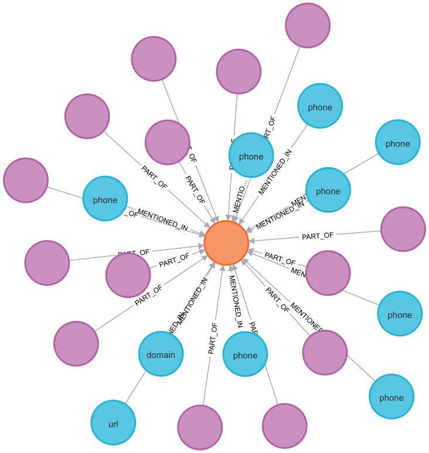

# 🚨 Threat Intel RAG Pipeline  

Graph-based **Retrieval-Augmented Generation (RAG)** system for **AI-powered threat intelligence**.  
All data — documents, text chunks, embeddings (via Neo4j native vector indexes), indicators, campaigns, etc. — are stored directly in **Neo4j**.  

---

## ✨ Features  

- ⚡ **Neo4j-only backend**  
  Stores documents, text chunks, embeddings, indicators, and campaigns → super fast queries.  
- 📄 **PDF ingestion pipeline**  
- 🎯 **Campaign support**  
  - Auto-created from PDF filenames  
- 🌐 **FastAPI REST API**  
  - Endpoints: `search`, `context`, `timeline`, `clusters`, `campaign`  
- 💬 **Chatbot (NiceGUI)**  
  - Frontend UI built with NiceGUI  
  - Connects to FastAPI agent routes  
  - Generates conclusions using **Meta-LLaMA** over retrieved chunks  

---

## 🏗️ Architecture  

1. **Pipeline**  
   PDFs → chunked → embeddings generated → inserted into Neo4j with indicators + campaign links  

2. **Graph Database (Neo4j)**  
   - **Nodes:** `Document`, `Chunk`, `Indicator`, `Campaign`  
   - **Relationships:** `PART_OF`, `MENTIONED_IN`, `PART_OF_CAMPAIGN`  

3. **FastAPI**  
   - REST API + LangGraph Agent  

4. **Chatbot UI**  
   - Built with NiceGUI  
   - Calls FastAPI routes  
   - Meta-LLaMA generates final conclusions  

---

## 🔗 System Diagram  


## 🛠️ Tech Stack

| Component     | Role                           |
| ------------- | ------------------------------ |
| **Python**    | Pipeline + API                 |
| **NiceGUI**   | Frontend chatbot               |
| **FastAPI**   | REST backend                   |
| **Neo4j**     | Graph database + vector search |
| **LangChain** | LLM orchestration & tools      |
| **Docker**    | Container orchestration        |


## ⚙️ Setup 
1. Clone the reo:
    ```
        git clone <>
        cd <repo>
    ```

2. Run pipeline
    ```
        make run-pipeline

        # You can run make help command and perform the required setup.
    ```

3. Run frontend
    ```
        # made as third party interface
        make run-frontend
    ```

## 🧪 Testing
For testing locally run this commmand
```
    make run-graph-container  # this runs the local neo4j vector db
    pip install -r requirements-local.txt
    make run-test
```

## 📜 API Documentation

[openapi_schema](./openapi_schema.json)


## 📊 Graphs in neo4j browser 





## 📋 Performance Metrics

| Metric | Value |
| ------- | ------|
| Document Load Time | ~ 20s |
| Extraction & Embedding | ~20s |
| Graph Query  | < 300 ms |
| Rest API Queries | < 4200 micro seconds |


## 📌 Deliverables Checklist
  ✅ Docker Orchestration (Neo4j, FastAPI, Nicegui, Langchain)
  ✅ Processing pipelines with unit testing
  ✅ API Endpoints (Swagger UI with documentation)
  ✅ Graph Visualization via Neo4j
  ✅ Performance Report
  ✅ README with architecture

## 📞 Info
  Developed by Tezz Chaudhary.